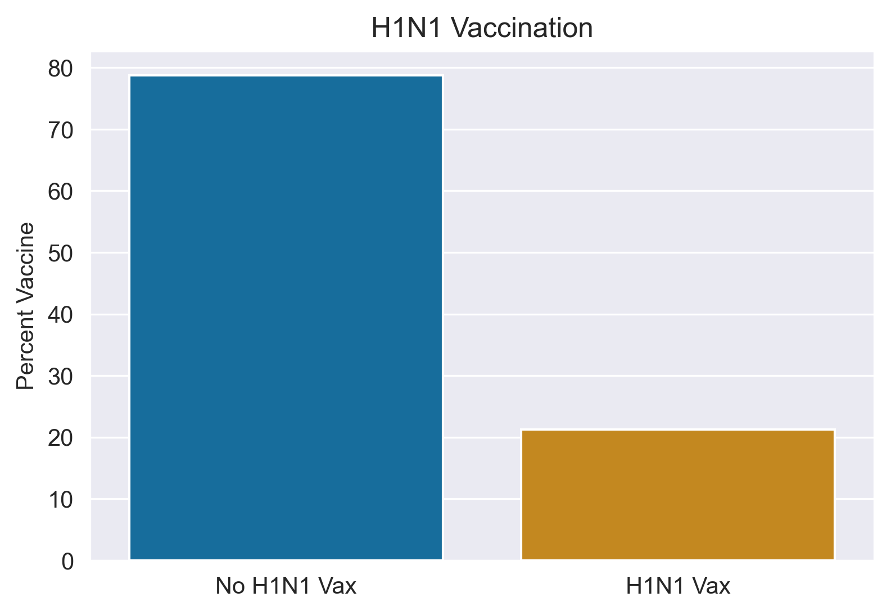
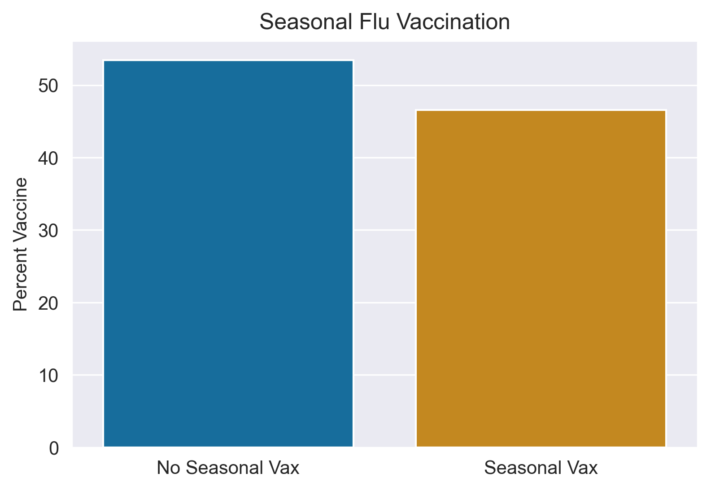
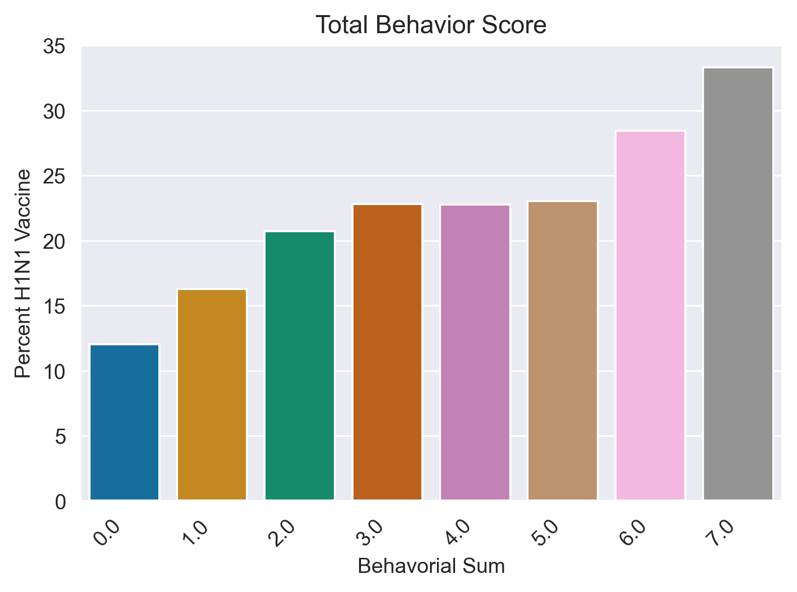
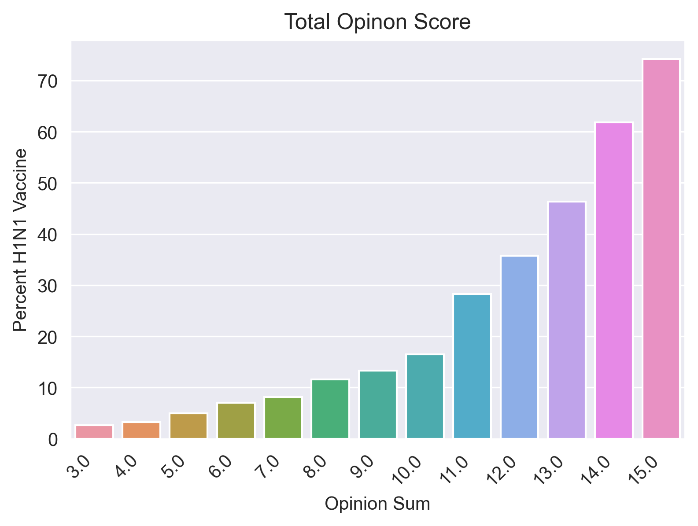
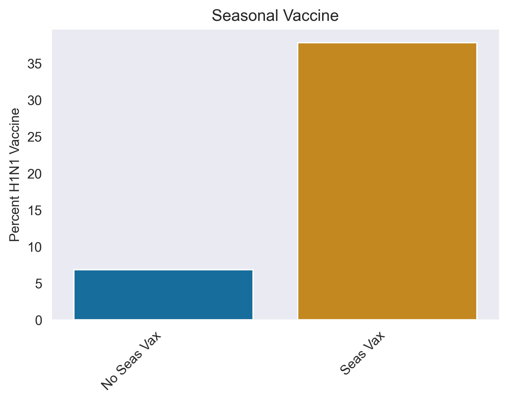
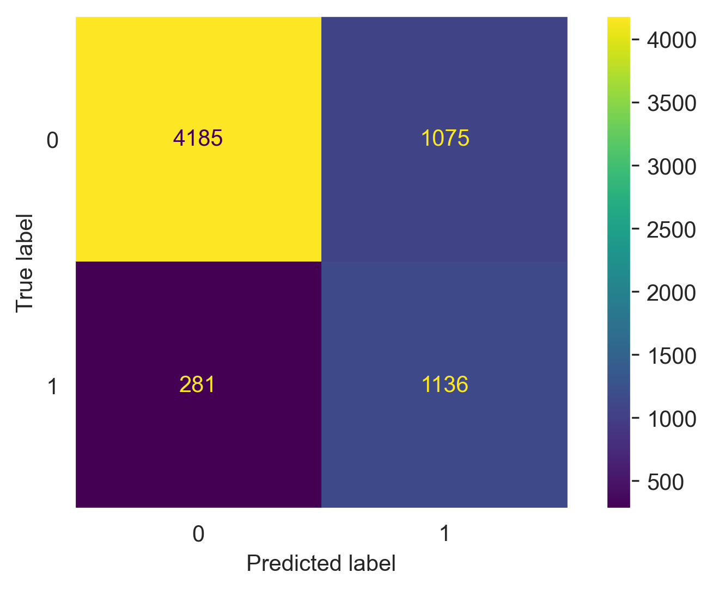

# Preparing for Future Pandemics Vaccine Needs

## Overview

This project aims to help health providers prepare for the vaccination needs for future pandemics. From community clinics to health care providers with hospitals and offices aross regions, they will need know the amount of vaccines needed. The goals are to understand the indicators for recieving pandemic vaccines and build a model that will predict those who will get a pandemic vaccine.

## Business Understanding

Healthcare providers need to know how many vaccines  purchase or request, depending on the national distribution plan, so that all patients who want a vaccine recieve one and will not collect a large surplus. To answer this question we are going to build a model trained on data of individuals who recieved the h1n1 vaccine, to use to predict individuals who will likely recieve a future pademic vaccination. While overall accuracy is important, because health care providers would rather have slightly more vaccines than needed, rahter than being short and not having vaccines for individuals that requested them, we will focus on achieveing a high recall score.

## Data Understanding
The data comes from an over 26,000 person phone survey conducted in 2010, a year after the H1N1 outbreak, in which participants were asked about receiving the H1N1 vaccine, the seasonal flu vaccine, opionons about vaccines, behaviors around transmitting illness, and demograpic information. 

## Data Exploration

The dataset now has 26707 rows (survey respondents), and 38 columns (vairiables including id and targets). It has 12 objects and 26 numeric indicators. Indicators related to behavioral questions are binary,indicators related to opinion questions are a five point scale, numerical and srtingindicators related to demographics are of varying numbers of response choices, amd respondent ID is a unique identifer. The targets are binary, 0 or 1. 'health_insurance', 'employment_industry', and 'employment_occupation' all have over 50% nulls. Other columns contain a small percentage of nulls.

Of all respondents, 21% received the H1N1 vaccine. Notably, this is far less than those that reported receiving the annual flu vaccine, at 47%. 38& of those that recieved the seasonal flu vaccine recieved the H1N1 vaccine, 7% who did not recieve the seasonal flu vaccine recieved the H1N1 vaccine. 

Which grouping of questions is a better indicator of liklihood to get a vaccine? Note that for 'opinion_h1n1_sick_from_vacc', the higher score is associated with a negative relationship to teh vaccine, so add (6 - 'opinion_h1n1_sick_from_vacc') in the opinion sum. 

The opinion sum had a larger difference in percent of those that received the vaccine between the lowest and highest opinion scores, than that of the lowest and highest behavioral score.

Doctor recommendation was one of the indicators with the greatest percent of those who received the vaccination and largest difference in percentage between the choices for the indicator. 53% of those who received a doctor's recommendation got the vaccine, whereas only 13% who did not receive a doctor’s recommendation got the vaccine. A difference this indicator has from others is your ability to influence. Many indicators you cannot directly change, however you can for the number of your patients who receive a recommendation of a vaccination from your doctors. 78% of respondents reported that they did not receive a doctor's recommendation for the vaccine.

## Modelling
After running adummy model, a first simple model

### Grid search with CV models

A logistic regression model gridsearch is run using he following parameter combinations:
        
        lr_params = {
                      'ct__num_trans__num_impute__strategy' : ['mean', 'median'],
                      'lr__penalty' : ['l1', 'l2', 'elasticnet'],
                      'lr__C' : [100, 10, 1.0, 0.1, 0.01],
                      'lr__solver' : ['lbfgs', 'liblinear', 'saga'],
                      }
                      
 Results:
 * Best parameters
 
>       {'ct__num_trans__num_impute__strategy': 'mean',
>       'lr__C': 0.01,
>       'lr__penalty': 'l1',
>       'lr__solver': 'liblinear'}

* Best score
>       0.8076

A random forest classifier model gridsearch is run using he following parameter combinations:
        
        rfc_params = {
                        'ct__num_trans__num_impute__strategy' : ['mean', 'median'],
                         'rfc__criterion' : ['gini', 'entropy', 'log_loss'],
                        'rfc__max_depth' : [9, 11, 13, 15],
                        'rfc__min_samples_leaf' : [1, 5, 15,]
                        }
                      
 Results:
 * Best parameters
 
>       {'ct__num_trans__num_impute__strategy': 'mean',
>       'rfc__criterion': 'entropy',
>       'rfc__max_depth': 11,
>       'rfc__min_samples_leaf': 15}

* Best score
>       0.6260

Because the best parameters had a parameter, min_sample_leaf, at the far end of our options, run another model with the best  parameters but increasing the options for min_sample_leaf. The following was run:

        
        rfc_params = {
                        'ct__num_trans__num_impute__strategy' : ['mean', 'median'],
                         'rfc__criterion' : ['gini', 'entropy', 'log_loss'],
                        'rfc__max_depth' : [11],
                        'rfc__min_samples_leaf' : [15, 17, 19, 21, 23]
                        }
                      
 Results:
 * Best parameters
 
>       {'ct__num_trans__num_impute__strategy': 'mean',
>       'rfc__criterion': 'entropy',
>       'rfc__max_depth': 11,
>       'rfc__min_samples_leaf': 21}

* Best score
>       0.6295

## Evaluation
The logistic regression model with a numerical impute strategy of 'mean, C: .01, penalty: l1, and solver: liblinear, was our best performing model on trained data and cross validation.

* Recall Score: 0.8038
* Precision Score: 0.5135

## Conclusion

The model predicted 80% of the H1N1 recipients on the test data, however, almost half of its total predicted H1N1 recipients were false positives. This model in it's current state could lead health care providers to over purchasing or requesting vaccines. To improve the model the model for health care provider use, updated data should be gathered about their specific specific patient populations.
